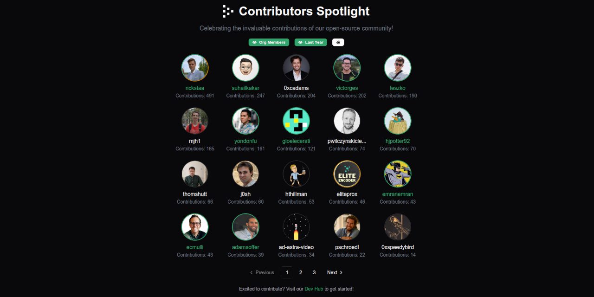

# Contributors Spotlight

[](https://contributors-spotlight.vercel.app/)

This repository contains a web application showcasing open-source contributors' invaluable contributions to a GitHub organization. It is built using [Next.js](https://nextjs.org/), [Shadcn](https://ui.shadcn.com/), and the [GitHub API](https://github.com/PyGithub/PyGithub). The example uses the [Livepeer](https://github.com/livepeer) organization but can be adapted to any other organization.

## Getting Started

### Prerequisites

- [Python](https://www.python.org/)
- [Node.js](https://nodejs.org/)

### Setup

1. **Fork this repository** by clicking the fork button on the top right corner of this page.

2. **Clone the repository** to your local machine:

   ```bash
   git clone git@github.com:<YOUR_USERNAME>/contributors-spotlight.git
   cd contributors-spotlight
   ```

3. **Create a Python virtual environment and install dependencies:**

   ```bash
   python -m venv venv
   source venv/bin/activate
   pip install -r scripts/requirements.txt
   ```

4. **Set Python script environment variables:**

   ```bash
   export GITHUB_TOKEN=<YOUR_GITHUB_PAT>
   export ORG_NAME=<YOUR_ORG_NAME>
   export BOT_ACCOUNTS=<BOT_ACCOUNTS_TO_EXCLUDE>
   export EXCLUDE_REPOS=<REPOS_TO_EXCLUDE>
   ```

5. **Generate contributor info data locally:**

   ```bash
   python scripts/get_org_contributors_info.py
   ```

   After running the script, you should see a `contributors_info.json` file in the `scripts/assets` directory.

6. **Copy the `contributors_info.json` file to the `public` directory:**

   ```bash
   cp scripts/assets/contributors_info.json public/contributors_info.json
   ```

7. **Optional: Add a VIP contributors file:**

   To highlight certain contributors, create a `vip_contributors_info.json` file in the `public` directory with the following structure. Ensure the `login` matches the GitHub username in the `contributors_info.json` file:

   ```json
   [
     {
       "login": "username",
       "profile_url": "https://contributor-profile-url.com"
     },
     {
       "login": "username2",
       "profile_url": "https://contributor-profile-url.com"
     }
   ]
   ```

8. **Install Node.js dependencies:**

   ```bash
   npm install
   ```

9. **Set up environment variables for the web application:**

   Copy the `.env.example` file to a new `.env` file:

   ```bash
   cp .env.example .env
   ```

   Update the `.env` file with the following variables:

   ```bash
   CONTRIBUTORS_SOURCE=
   VIP_CONTRIBUTORS_SOURCE=
   NEXT_PUBLIC_VIP_LABEL=
   NEXT_PUBLIC_VIP_ICON=
   NEXT_PUBLIC_ORG_NAME=
   NEXT_PUBLIC_ORG_WEBSITE=
   NEXT_PUBLIC_ORG_LOGO_LIGHT=
   NEXT_PUBLIC_ORG_LOGO_DARK=
   ```

10. **Run the development server:**

```bash
npm run dev
```

You should now be able to access the web application at [http://localhost:3000](http://localhost:3000).

## Configuration

### Python Script Configuration

The Python script `get_org_contributors_info.py` fetches the contributor data from the GitHub API. The script uses the following environment variables:

- `GITHUB_TOKEN`: A GitHub personal access token with the `read:org` scope.
- `ORG_NAME`: The name of the GitHub organization.
- `BOT_ACCOUNTS`: A comma-separated list of bot accounts to exclude from the contributor data.
- `EXCLUDE_REPOS`: A comma-separated list of repositories to exclude from the contributor data.

#### Contributors Info JSON Example

The `contributors_info.json` file generated by the script should have the following structure:

<details>
<summary>Click to expand</summary>

```json
[
  {
    "login": "username",
    "name": "Full Name",
    "avatar_url": "https://avatars.githubusercontent.com/u/123456?v=4",
    "location": null,
    "company": null,
    "bio": null,
    "blog_url": "",
    "twitter_username": null,
    "org_member": true,
    "contributions": 123456,
    "yearly_contributions": 123
  },
  {
    "login": "username2",
    "name": "Full Name",
    "avatar_url": "https://avatars.githubusercontent.com/u/123456?v=4",
    "location": null,
    "company": null,
    "bio": null,
    "blog_url": "",
    "twitter_username": null,
    "org_member": true,
    "contributions": 123456,
    "yearly_contributions": 123
  }
]
```

</details>

### Web Application Configuration

The web application uses the following environment variables:

- `CONTRIBUTORS_SOURCE`: The path or URL to the `contributors_info.json` file containing the contributor data generated by the `get_org_contributors_info.py` script.
- `VIP_CONTRIBUTORS_SOURCE` (optional): The path or URL to the `vip_contributors_info.json` file containing the VIP contributor data.
- `NEXT_PUBLIC_VIP_LABEL` (optional): The label to use for VIP contributors (optional, default: `VIP`).
- `NEXT_PUBLIC_VIP_ICON` (optional): The icon to use for VIP contributors (optional, default: `star`).
- `NEXT_PUBLIC_ORG_NAME`: The name of the organization.
- `NEXT_PUBLIC_ORG_WEBSITE`: The website of the organization.
- `NEXT_PUBLIC_ORG_LOGO_LIGHT`: The light logo of the organization.
- `NEXT_PUBLIC_ORG_LOGO_DARK`: The dark logo of the organization.

### Widget Embed

The app includes a dedicated widget page you can embed without the site header. Use the `/widget` route to render the contributors grid in a minimal layout that fits well inside an iframe.

Example embed:

```html
<iframe
  src="https://your-deployment-url.com/widget"
  title="Contributors Spotlight"
  width="100%"
  height="800"
  style="border:0;"
  loading="lazy"
></iframe>
```

You can customize the widget by appending query parameters to the URL:

| Parameter          | Description                          | Values                          | Default  |
| ------------------ | ------------------------------------ | ------------------------------- | -------- |
| `orgMembers`       | Show only org members                | `true`, `false`                 | `false`  |
| `lastYear`         | Display last year's contributions    | `true`, `false`                 | `false`  |
| `page`             | Initial page number                  | Any positive integer            | `1`      |
| `paginationArrows` | Position of pagination arrows        | `bottom`, `side`                | `bottom` |
| `hidePageNumbers`  | Hide the page number indicators      | `true`, `false`                 | `false`  |
| `randomize`        | Randomize contributor order          | `true`, `false`                 | `false`  |
| `cols` / `columns` | Number of grid columns               | Any positive integer            | Auto     |
| `rows`             | Number of grid rows                  | Any positive integer            | Auto     |
| `theme`            | Force a specific theme               | `light`, `dark`                 | System   |
| `hideControls`     | Hide the control panel               | `true`, `false`                 | `false`  |

Example with parameters:

```html
<iframe
  src="https://your-deployment-url.com/widget?orgMembers=true&paginationArrows=side&hidePageNumbers=true"
  title="Contributors Spotlight"
  width="100%"
  height="800"
  style="border:0;"
  loading="lazy"
></iframe>
```

## Automating Contributor Data Generation

This repository includes a GitHub Action to automate the generation of contributor data (see [.github/workflows/org-contributors-info.yml](.github/workflows/org-contributors-info.yml)). This action runs the `get_org_contributors_info.py` script and publishes the generated `contributors_info.json` file to the repository's GitHub Pages. The action uses the Livepeer organization as an example. To use it for your organization, enable [GitHub Pages](https://pages.github.com/) for your forked repository and update the following environment variables in the action:

```yaml
ORG_NAME: <YOUR_ORG_NAME>
BOT_ACCOUNTS: <BOT_ACCOUNTS_TO_EXCLUDE>
EXCLUDE_REPOS: <REPOS_TO_EXCLUDE>
```

## Deploy on Vercel

The easiest way to deploy this web application is to use the [Vercel Platform](https://vercel.com/). For detailed instructions, please refer to the [Next.js deployment documentation](https://nextjs.org/docs/deployment).
